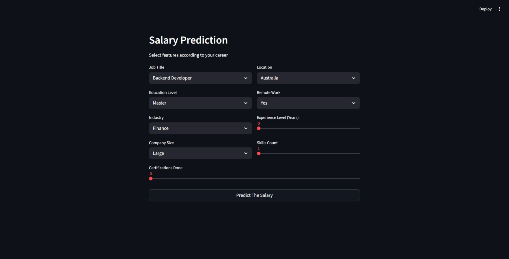

# Job Salary Prediction

A machine learning project that predicts the estimated salary for a job based on details like job title, experience, education, industry, skills, and location. The model is trained using XGBoost and deployed as an interactive web app using Streamlit.


## Website Interface


## Project Structure

```
Job_Salary_Prediction/
│
├── Job_Salary_Prediction.ipynb     # Jupyter Notebook (data analysis, training, evaluation)
├── job_salary_prediction_dataset.csv
│
└── website/
    ├── Main.py                     # Streamlit app
    ├── model.joblib                # Trained XGBoost model
    ├── encoder.joblib               # OneHotEncoder for categorical features
    ├── Columns.joblib               # Column order used for prediction
    └── requirements.txt
```

## How It Works

1. The dataset contains job-related features (job title, experience, education, industry, company size, location, remote work, skills count, certifications) and the target column `salary`.
2. Categorical columns are converted to numbers using `OneHotEncoder`.
3. An `XGBRegressor` model is trained on the processed data to predict salary.
4. The trained model, encoder, and column order are saved as `.joblib` files for use in the web app.
5. The Streamlit app (`Main.py`) takes user input, encodes it the same way, and predicts the salary.

## How to Run the App

### 1. Install Required Libraries

Open a terminal inside the `website` folder and run:

```bash
pip install -r requirements.txt
```

If `requirements.txt` is not available, install manually:

```bash
pip install streamlit pandas scikit-learn xgboost joblib
```

### 2. Run the Streamlit App

Make sure you are inside the `website` folder (where `Main.py`, `model.joblib`, `encoder.joblib`, and `Columns.joblib` are located), then run:


```bash
cd website
```

```bash
streamlit run Main.py
```

### 3. Use the App

- A browser window will open automatically (usually at `http://localhost:8501`).
- Select your job title, education level, industry, company size, location, remote work type, experience, skills count, and certifications.
- Click **Predict The Salary** to see the estimated salary.

## Retraining the Model

If you want to retrain the model on new data:

1. Open `Job_Salary_Prediction.ipynb` in Jupyter Notebook.
2. Run all cells in order — this will load the dataset, train the model, and save updated `model.joblib`, `encoder.joblib`, and `Columns.joblib` files.
3. Copy the updated `.joblib` files into the `website` folder so the app uses the new model.

## Requirements

- Python 3.11+
- pandas
- scikit-learn
- xgboost
- joblib
- streamlit
