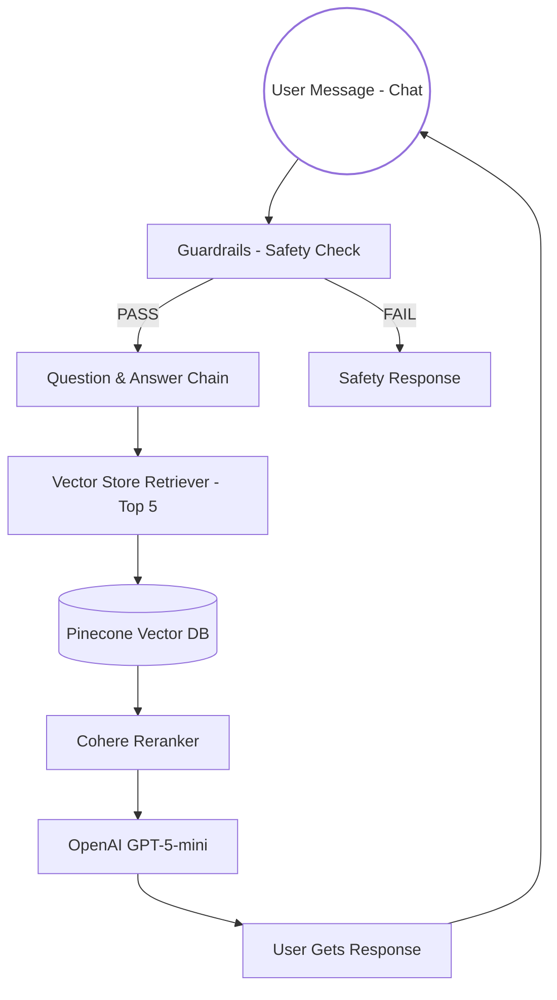
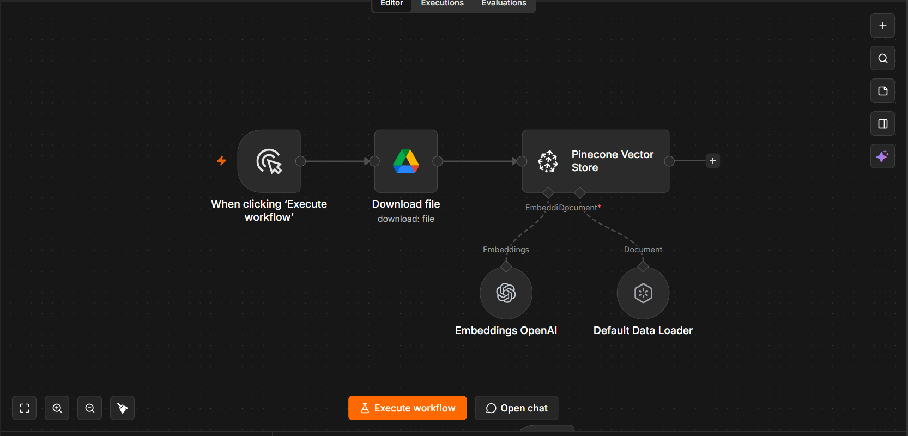
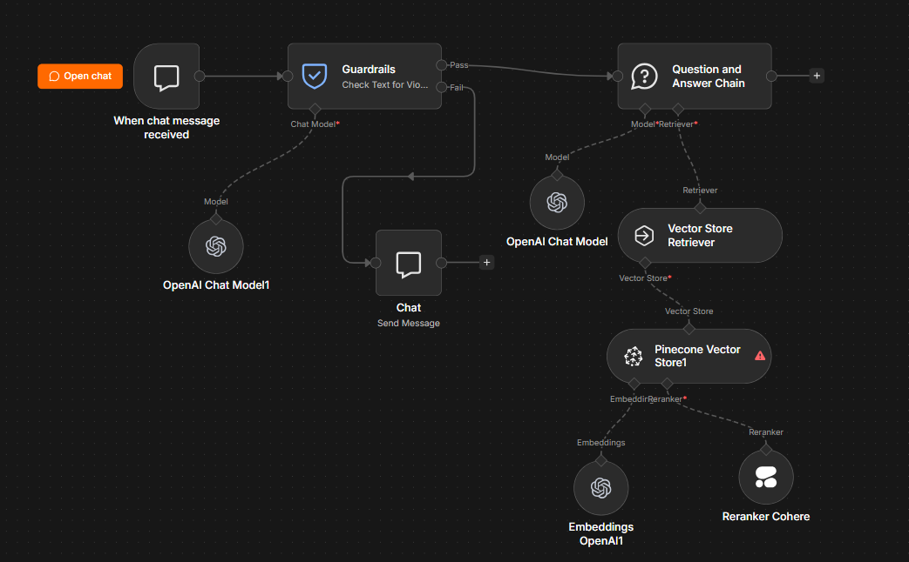

#  Mubashir's Customer Support Assistant

> **Intelligent RAG-Powered Customer Support Bot** | Built with n8n, Pinecone, OpenAI & Cohere

---

##  What This Project Does

This is an **AI-powered customer support chatbot** that automatically answers customer questions by retrieving relevant information from **Mubashir's Mart's customer support policies**. Instead of customers waiting for a human agent, the bot instantly provides accurate answers using **Retrieval-Augmented Generation (RAG)**.

Think of it as having a super-smart policy expert available 24/7 who knows every detail about returns, refunds, shipping, edge cases, and everything else in your company handbook.

---

##  How It Works (The Architecture)

---

## n8n Workflows 
 
 
Document Ingestion Workflow
            

 
 

RAG Chatbot Workflow
            

## Core Components

### 1. Chat Trigger
Receives real-time customer messages through the n8n chat interface.

### 2. Guardrails
Filters unsafe requests before processing, including:
- Jailbreak / prompt injection detection
- NSFW content detection
- PII detection

Passed requests continue to the RAG pipeline; blocked requests receive a safety response.

### 3. Document Ingestion
- Loads the customer support PDF
- Generates embeddings using OpenAI
- Stores vectors in Pinecone

### 4. Retrieval & Reranking
- Retrieves the top 5 relevant policy chunks from Pinecone
- Cohere Reranker re-ranks results to improve relevance

### 5. Answer Generation
GPT-5-mini generates a concise response using the retrieved policy context to keep answers grounded in the knowledge base.

### 6. Fallback Handler
Blocked requests receive a predefined safety message.

---

## The Dataset: Mubashir's Mart Policy

The chatbot uses a **22-section customer support policy** covering:

- Returns & refunds
- Shipping & delivery
- Product-specific return windows
- Refunds & payments
- Customer membership tiers
- Fraud prevention
- Support escalation
- Special cases and edge scenarios

The policy includes **22 complex edge cases**, temporal rules, and conditional policies such as:

- Warranty vs. return-policy decisions
- Tier-based return extensions
- Bundle discount calculations
- Shipping damage grace periods
- Chargeback and fraud conditions

This gives the RAG system realistic and challenging customer-support scenarios to handle.

---

## How to Set Up

### Prerequisites

- n8n (Cloud or self-hosted)
- Pinecone account
- OpenAI API key
- Cohere API key
- Google Drive access

### Setup

1. Import `Customer_Support_Assistant.json` into n8n.
2. Upload the policy PDF to Google Drive.
3. Configure Google Drive, OpenAI, Pinecone, and Cohere credentials.
4. Create a Pinecone index with the correct embedding dimension and cosine similarity.
5. Execute the ingestion workflow to process and store the policy.
6. Open the n8n chat and test the assistant.

### Example

**User:** Can I return my phone after 10 days?

**Assistant:** For electronics, the standard return window is 7 days.

**User:** I'm a Gold member. Do I get an extension?

**Assistant:** Yes. Gold members receive a 3-day extension, making the total window 10 days.

---

## Example Questions

### Simple
- "What's your return policy?"
- "How long does shipping take?"

### Category-Specific
- "Can I return electronics after 5 days?"
- "Are opened cosmetics returnable?"

### Complex Edge Cases
- "I found a phone defect on day 8. Can I return it?"
- "How much refund do I get if I return one item from a discounted bundle?"
- "Do Gold members get a return extension?"

### Guardrails
The assistant blocks:
- Jailbreak / prompt injection attempts
- Inappropriate content
- Requests involving PII exploitation
---

## Safety Features

| Feature | Purpose |
|---------|---------|
| Jailbreak Detection | Prevents prompt injection |
| NSFW Filter | Blocks inappropriate content |
| PII Detection | Detects sensitive personal information |
| Chargeback Flag | Helps identify potential fraud |
| Return Rate Limit | Helps prevent return abuse |

---

## Performance & Coverage

- **Policy Coverage:** 22 sections
- **Edge Cases:** 22 complex scenarios
- **Retrieval:** Top-5 candidate retrieval + Cohere reranking
- **Response Generation:** GPT-5-mini
- **Integrations:** n8n, Pinecone, OpenAI, Cohere, Google Drive

