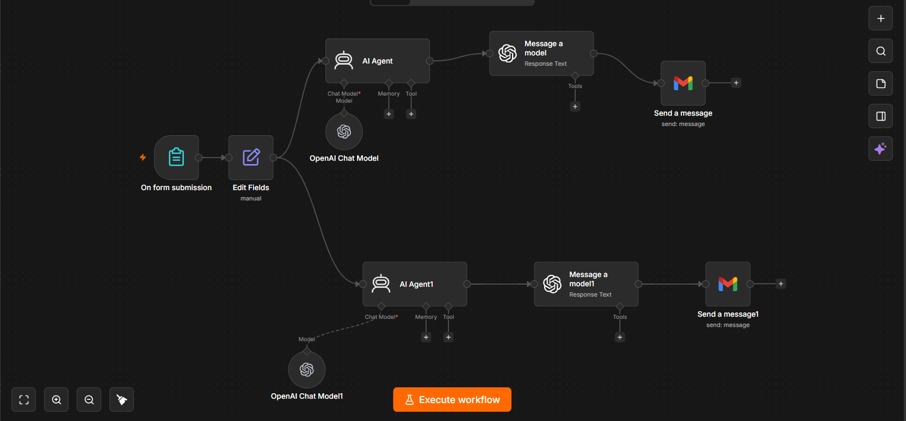

# Client Onboarding Automation (n8n)

An automated client onboarding workflow built with **n8n**. When a new client fills out an intake form, the workflow uses AI agents to generate and send two personalized emails automatically — a **Welcome Email** and a **Terms of Service Agreement**.

## Workflow Preview

## How It Works

1. **On Form Submission** — A client fills out an intake form with their Name, Email, Company, Required Service, Mobile Number, and Preferred Starting Date.
2. **Edit Fields** — The submitted form data is cleaned and mapped into structured fields for use in the next steps.
3. **Two AI Agents run in parallel:**
   - **AI Agent (Welcome Email)** — Uses GPT-5-mini to generate a warm, professional welcome email based on the client's details.
   - **AI Agent1 (Terms of Service Email)** — Uses GPT-5-mini to generate a formal Terms of Service & Agreement email.
4. **Message a Model / Message a Model1** — Each AI Agent's raw output is passed through a structured JSON parser to cleanly separate the **Subject** and **Body** of the email.
5. **Send a Message / Send a Message1** — The final formatted emails are sent to the client's email address via Gmail.

## Result

The client automatically receives:
- ✅ A personalized **Welcome Email**
- ✅ A **Terms of Service** email with contract details and contact info

All without any manual work — fully automated from form submission to inbox.

## Tech Stack

- **n8n** — Workflow automation
- **OpenAI (GPT-5-mini)** — AI email generation with structured JSON output
- **Gmail API** — Sending emails
