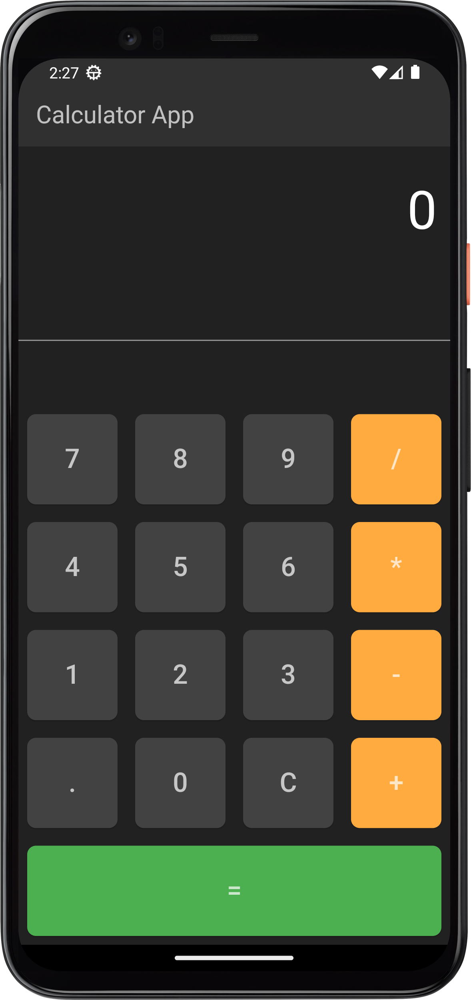

# Calculator App

A simple Flutter calculator app for basic arithmetic operations.

## Screenshot

## Features

- Addition, subtraction, multiplication, and division
- Decimal point support
- Clear (C) button to reset

## Getting Started

1. Clone or download this project.
2. Run `flutter pub get` to install dependencies.
3. Run `flutter run` to launch the app.

## Requirements

- Flutter SDK
- Dart