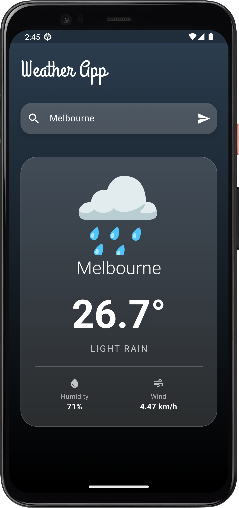
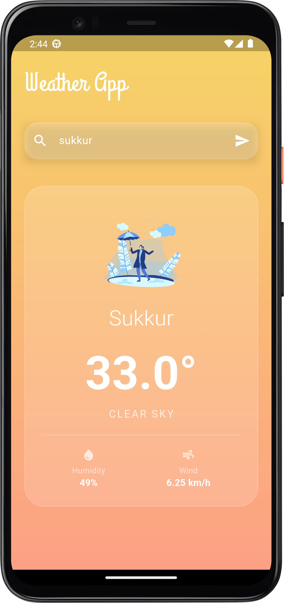
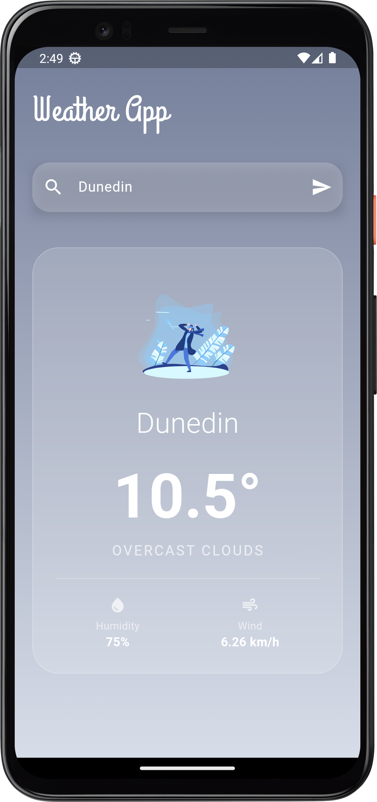

# Weather App

A simple Flutter weather app that shows current temperature, condition, humidity, and wind speed for any city.

## Screenshots

  
  &nbsp;&nbsp;
  
  &nbsp;&nbsp;
  
  &nbsp;&nbsp;
  

## Features

- Search weather by city name
- Displays temperature, weather condition, humidity, and wind speed
- Dynamic background and icons based on weather condition

## Getting Started

1. Clone or download this project.
2. Run `flutter pub get` to install dependencies.
3. Run `flutter run` to launch the app.

## Requirements

- Flutter SDK
- Dart
- Internet connection (for weather API)