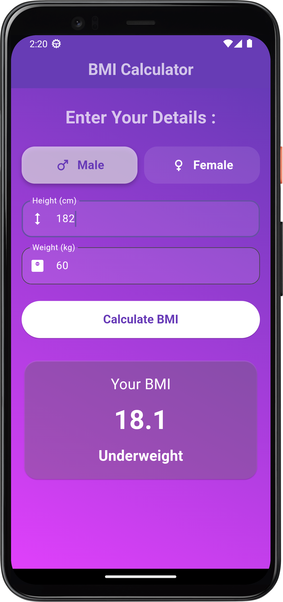

# BMI Calculator
 
A simple Flutter app to calculate Body Mass Index (BMI) based on height and weight.
 
## Screenshot
 

 
## Features
 
- Enter height (cm) and weight (kg)
- Select gender (Male/Female)
- Calculates BMI and shows category: Underweight, Normal, Overweight, or Obese
## Getting Started
 
1. Clone or download this project.
2. Run `flutter pub get` to install dependencies.
3. Run `flutter run` to launch the app.
## Requirements
 
- Flutter SDK
- Dart
