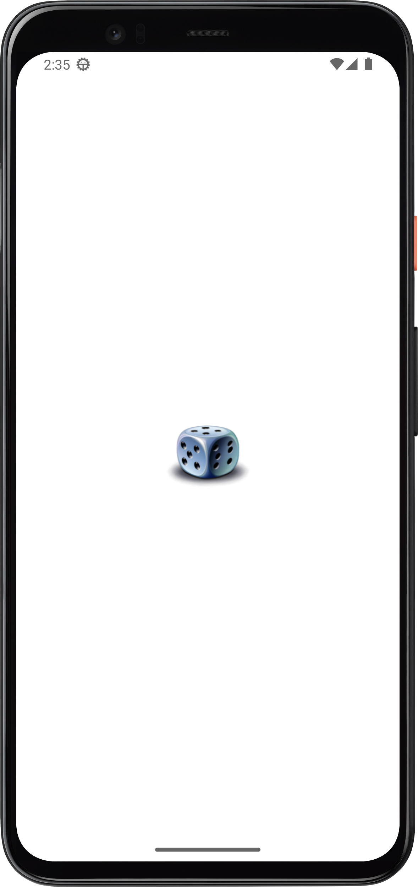
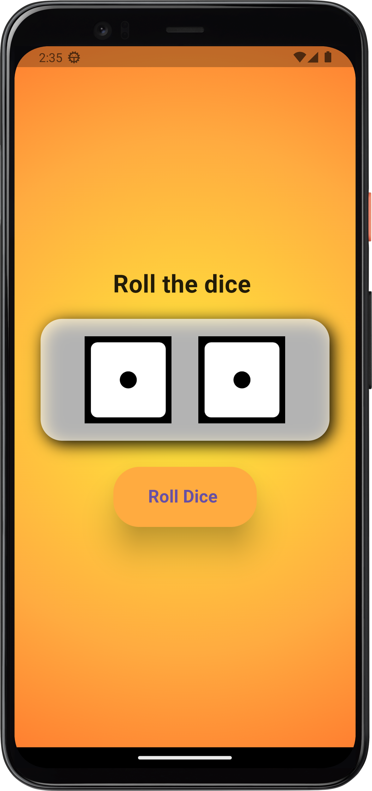

# Dice App

A simple Flutter app that rolls two dice with a tap of a button.

## Screenshots

 

## Features

- Tap "Roll Dice" to randomly roll two dice
- Simple and colorful UI

## Getting Started

1. Clone or download this project.
2. Run `flutter pub get` to install dependencies.
3. Run `flutter run` to launch the app.

## Requirements

- Flutter SDK
- Dart